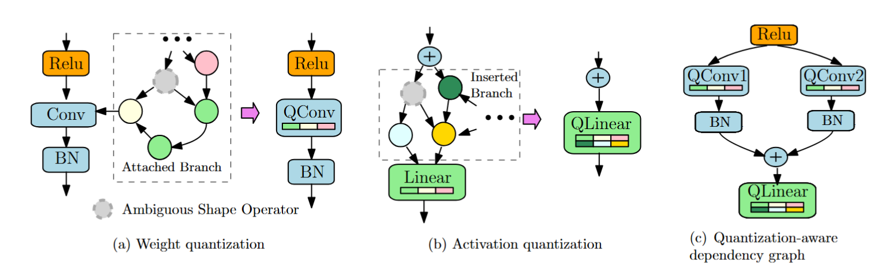

# GETA and beyond
This repo provides the extension of the implementation of **GETA**, a **G**eneric, **E**fficient **T**raining framework that **A**utomates joint structured pruning and mixed precision quantization. GETA is architecture agnostic and user-friendly. Using **GETA**, one can compress a wide range of neural network architecures including but not limited to convolutional neural networks, transformers, vision transformers, and small language models with minimal engineering efforts on the user side.

You can find the original GETA repo [HERE](https://github.com/microsoft/geta), for the citation paper, see:

```
@article{qu2025automatic,
  title={Automatic Joint Structured Pruning and Quantization for Efficient Neural Network Training and Compression},
  author={Qu, Xiaoyi and Aponte, David and Banbury, Colby and Robinson, Daniel P and Ding, Tianyu and Koishida, Kazuhito and Zharkov, Ilya and Chen, Tianyi},
  journal={arXiv preprint arXiv:2502.16638},
  year={2025}
}
```

## Features
The GETA framework features two essential modules, quantization-aware dependency graph (QADG) analysis and quantization-aware structured sparse optimizer (QASSO).

* Graph Analysis. **GETA** first constructs the pruning search space that supports structured pruning. Careful computational graph optimization is introduced to handle both weight quantization and activation quantization. The following figure visualizes the general idea of how graph analysis is performed.

  

* QASSO Optimizer. **GETA** next deploys **QASSO** optimizer to figure out the tradeoff between pruning and compression given the compression constraints. QASSO is a white-box optimizer for an optimization problem with both sparisty and quantization constraints, which is formulated as
```math
\begin{aligned}
\min_{x,d,q_m,t} & f(x, d, q_m, t) \\
\text{s.t.} & \text{Card}\{g \in \mathcal{G} \mid [{x}]_g = 0 \} = K, \\
& b_i \in [b_l, b_u], \quad i \in \mathcal{L},
\end{aligned}
```
where $\mathcal{G}$ represents the set of parameter groups and $K$ represents the target sparsity ratio and $[b_l, b_u]$ specifies the target bit width range, and $\mathcal{L}$ denotes the index set of layers that have parameterized quantization layers added. By white-box, one can explicity control the sparsity level $K$ and the bit width range $[b_l, b_u]$.

## Installation - from the original repo
We recommend to run the framework under `pytorch>=2.0` and to use `git clone` to install.

```bash
git clone https://github.com/microsoft/geta.git
```

We also offer a `pyproject.toml` and can be installed with `uv`. You can simply do:

```bash
# Create a virtual environment with uv
uv venv
source .venv/bin/activate
uv sync
```

If you do not have `uv`, you can either download it with:

```bash
# Use curl
curl -LsSf https://astral.sh/uv/install.sh | sh
# Or wget
wget -qO- https://astral.sh/uv/install.sh | sh
# Or pip
pip install uv

# When uv is installed via the standalone installer, it can update itself on-demand
uv self update
```

Check out [uv](https://docs.astral.sh/uv/getting-started/installation/) for more details. But it is also

## Quick Start

### Running the demo

```bash
# Try the vgg7 with CIFAR10 
python qvgg7_xaigeta_demo.py

# To compare with the GETA 
python qvgg7_geta_demo.py
```

### Running script

We also have a `run_xaigeta_experiments.sh` ready for running the demo:

```bash

Options:
  -m, --method METHOD     Attribution method (default: run all methods)
  -w, --weight WEIGHT     Attribution weight 0.0-1.0 (default: 0.3)
  -e, --epochs EPOCHS     Number of epochs (default: 50)
  -d, --device DEVICE     Device to use (default: cuda:0)
  -a, --all               Run all methods with all default weights
  -f, --fast              Run only fast methods (saliency, input_x_gradient, deconvolution)
  -l, --list              List all available attribution methods
  -h, --help              Show this help message

Examples:
  ./run_xaigeta_experiments.sh -m saliency -w 0.3 -e 50    # Single experiment
  ./run_xaigeta_experiments.sh --all                        # All methods with weights 0.1, 0.3, 0.5
  ./run_xaigeta_experiments.sh --fast -e 10                 # Fast methods, 10 epochs each

Available methods:
  - saliency
  - input_x_gradient
  - guided_backprop
  - deconvolution
  - layer_conductance
  - layer_gradient_x_activation
  - layer_integrated_gradients
  - deep_lift
  - integrated_gradients
  - lrp
  - layer_lrp
```

## The XAI-GETA 

XAI-GETA extends GETA by incorporating **Captum attribution methods** (e.g., Saliency) to provide data-driven importance scores:

| Method | Weight | Description |
|--------|--------|-------------|
| `attribution` (xAI) | **0.30** | Captum saliency-based importance |
| `magnitude` | 0.21 | L2 norm of weights |
| `taylor_first_order` | 0.28 | First-order Taylor expansion |
| `cosine_similarity` | 0.21 | Alignment between weights and gradients |

### Example: Saliency-Based Attribution

**Saliency** computes the gradient of the output with respect to the input/activations:

$$I_{saliency}^{(l)} = \left| \frac{\partial y_c}{\partial \mathbf{a}^{(l)}} \right|$$

Where:
- $y_c$ is the output score for the target class $c$
- $\mathbf{a}^{(l)}$ is the activation at layer $l$

For per-group importance, we aggregate over spatial dimensions and batch:

$$I_{attr}^{(g)} = \sum_{b,h,w} \left| \frac{\partial y_c}{\partial a_{b,g,h,w}^{(l)}} \right|$$

**Implementation (XAI-GETA):**
```python
# Using Captum's Saliency
from captum.attr import Saliency

def compute_saliency_attribution(model, input_tensor, target):
    saliency = Saliency(model)
    attributions = saliency.attribute(input_tensor, target=target)
    return attributions

# Aggregation to per-group scores
def compute_attribution_importance(attribution_tensor, num_groups):
    if attribution_tensor.dim() == 4:  # Conv2d: [batch, channels, H, W]
        scores = torch.abs(attribution_tensor).sum(dim=(0, 2, 3))  # Sum over batch, H, W
    elif attribution_tensor.dim() == 2:  # Linear: [batch, features]
        scores = torch.abs(attribution_tensor).sum(dim=0)
    return scores
```

---

#### Methods Used for Structured Pruning

| Method | Speed | Use Case | Why Suitable |
|--------|-------|----------|--------------|
| **Saliency** | Fast | Default | Fast, single gradient pass, works with any model |
| **DeepLift** | Medium | Alternative | Reference-based decomposition, stable |
| **IntegratedGradients** | Slow | High-quality | Path integral, theoretically grounded |
| **InputXGradient** | Fast | Simple | Input * gradient, intuitive |
| **GuidedBackprop** | Fast | Visualization | Only positive gradients propagated |
| **LayerConductance** | Medium | Layer-specific | How much a layer affects output |
| **LayerGradientXActivation** | Medium | Layer-specific | Gradient * activation at layer |

#### LRP (Layer-wise Relevance Propagation) - Special Considerations

```python
# LRP requires model architecture constraints:
# 1. No in-place operations (ReLU(inplace=True) breaks LRP)
# 2. Specific layer types supported

# WRONG: Will fail with LRP
nn.ReLU(inplace=True)  # ❌ In-place modifies tensor, breaks gradient flow

# CORRECT: Works with LRP
nn.ReLU(inplace=False)  # ✅ Creates new tensor, LRP can track
```

**To use LRP:**
1. Ensure all ReLU layers use `inplace=False`
2. Avoid other in-place operations (`+=`, `*=`, `.add_()`, etc.)
3. Use supported layer types (Conv2d, Linear, BatchNorm)

## Why XAI Works Better

### Key Advantages of Saliency-Based Attribution

#### Data-Driven Importance

Traditional methods (magnitude, Taylor) compute importance based only on:
- Weight values
- Instantaneous gradients

Saliency attribution computes importance based on:
- **Actual input data** flowing through the network
- How each neuron/channel contributes to the **final prediction**

$$\text{Traditional: } I^{(g)} = f(\mathbf{w}^{(g)}, \nabla_w L^{(g)})$$

$$\text{XAI: } I^{(g)} = f(\mathbf{w}^{(g)}, \nabla_w L^{(g)}, \mathbf{x}, \hat{y})$$

#### Captures Functional Importance

Consider two neurons with identical weight magnitudes but different contributions to the output:

| Neuron | Weight Magnitude | Taylor Score | Saliency Score |
|--------|------------------|--------------|----------------|
| A | 1.0 | 0.5 | **2.3** (high impact on output) |
| B | 1.0 | 0.5 | **0.1** (low impact on output) |

Traditional methods would give them similar importance scores.
XAI correctly identifies that Neuron A contributes more to the predictions.

#### Better Signal-to-Noise Ratio

Saliency aggregates information across multiple input samples, reducing noise:

$$I_{saliency}^{(g)} = \mathbb{E}_{\mathbf{x} \sim \mathcal{D}} \left[ \left| \frac{\partial y_c}{\partial \mathbf{a}^{(g)}} \right| \right]$$

Traditional gradient-based methods use single mini-batch gradients which are noisy.

#### Mathematical Justification

The saliency score directly measures how sensitive the output is to changes in a layer's activation:

$$\frac{\partial y}{\partial a^{(l)}} \approx \frac{\Delta y}{\Delta a^{(l)}}$$

A high saliency score means:
- Small changes in this layer cause large changes in output
- **This layer is important for the prediction**

A low saliency score means:
- This layer has minimal impact on the output
- **Safe to prune**

#### Information Flow Comparison

```
Original GETA:
┌─────────────────────────────────────────────────────────┐
│ Input → [Layer 1] → [Layer 2] → ... → [Layer N] → Loss  │
│                                              ↑          │
│                                       Only gradients    │
│                                       (backward pass)   │
└─────────────────────────────────────────────────────────┘

XAI-GETA:
┌─────────────────────────────────────────────────────────┐
│ Input → [Layer 1] → [Layer 2] → ... → [Layer N] → Loss  │
│    ↓         ↓           ↓                  ↑           │
│ Data      Data        Data             Gradients        │
│ Context   Context     Context         (backward pass)   │
│    ↓         ↓           ↓                  ↑           │
│ Attributions computed for each layer using actual data  │
└─────────────────────────────────────────────────────────┘
```

## Experimental Setup

- **Bit width reduction**: \( b_r = 2 \)  
- **Bit width range**: \([b_l, b_u] = [4, 16]\)  
- **Exponential**: \( t = 1 \)  
- **Maximum quantization range**: \( q_m = 32/8 \) bits  
- **Datasets**:  
  - CIFAR-10: VGG7, ResNet20  
  - ImageNet: ResNet50  
  - SQuAD: BERT  

---

## Training & Pruning Configuration Table

| Model     | Sparsity         | Total Epochs | Projection Periods \(B\) | Projection Steps \(K_b\) | Pruning Periods \(P\) | Pruning Steps \(K_p\) | Optimizer             |
|----------|------------------|--------------|----------------------------|----------------------------|-------------------------|-------------------------|-----------------------|
| VGG7     | 0.7              | 200          | 5                          | 20                         | 10                      | 30                      | Adam (1e-3) + StepLR |
| ResNet20 | 0.35             | 350          | 7                          | 35                         | 5                       | 30                      | SGD (1e-1) + StepLR  |
| ResNet50 | 0.4, 0.5         | 120          | 5                          | 5                          | 10                      | 10                      | SGD (1e-1) + StepLR  |
| BERT     | 0.1, 0.3, 0.5, 0.7| 10           | 4                          | 1                          | 6                       | 6                       | AdamW (3e-5)        |

#### Saliency-based results

TODO

Now I need you to create 